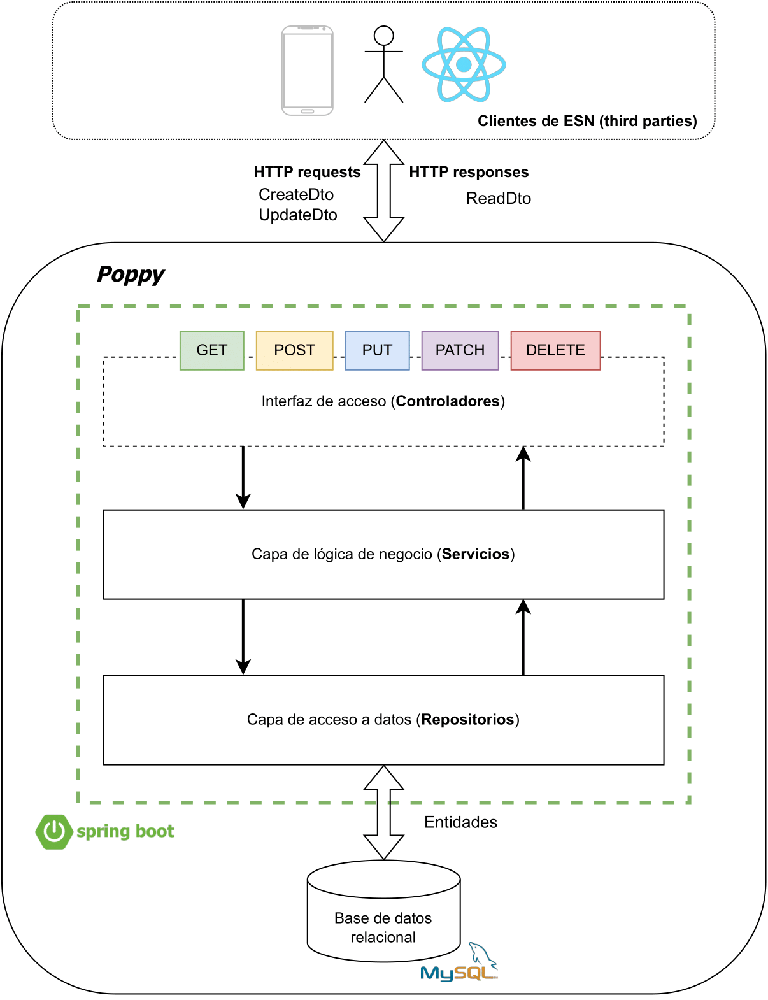

# 🤖 Poppy 🌺

:books: Repository of the **_Master's Thesis_** for the Master's Degree in Computer Science from the University of Granada.

:octocat: Project by **Ramón García Verjaga** :octocat:

:mag_right: **Status report** :bar_chart:

[![Poppy [API] / App / Deployment](https://github.com/ramongarver/Poppy/actions/workflows/poppy.api.deployment.yml/badge.svg)](https://github.com/ramongarver/Poppy/actions/workflows/poppy.api.deployment.yml)

       

## ✏️ ¿What is Poppy? 📜

Poppy is an internal management application tailored for ESN. The application plays a critical role in facilitating the complex administrative tasks associated with managing volunteers, organizing workgroups, and planning activities for international students. Its key function lies in simplifying the labor-intensive process of assigning volunteers to activities. Poppy seeks to automate and streamline the complete lifecycle, from storing volunteer information and workgroup details to automating the assignment of coordinators for activities slots. Poppy is exposed through a REST API, making it flexible for integration with any client applications.

## 🏗️ System architecture ⚙️

For **Poppy**, we have chosen to use the **layered structure**. This choice is based on simplicity and ease of adoption for any new developer joining the project. Furthermore, since the developed system is not extremely complex in terms of different business domains, the layered structure provides an effective and easy-to-understand way to organize the code. However, as the project grows, it may be considered to reorganize the code into a domain-based structure to facilitate scalability and maintenance.

### Application Layers

- `auth`: Contains classes and configuration related to authentication and authorization.
- `config`: Houses configuration files for various aspects of the application, such as security, OpenAPI documentation, and other custom beans.
- `constant`: Contains constants used throughout the project to keep the code clean and easy to update.
- `controller`: Contains all controller classes that handle HTTP requests.
- `dto`: Contains data transfer object classes, which serve to map domain objects (entities) to a simplified version that will be sent to and from the client.
- `entity`: Contains domain classes representing database tables.
- `enums`: Defines enumerations used in the application, typically for lists of fixed values. For example, roles or types of activity packages.
- `exception`: Contains classes that handle custom exceptions throughout the application.
- `filter`: Includes filters applied to HTTP requests and responses, often used for tasks such as logging, security, or request/response modification.
- `mapper`: Contains classes that map one object to another, usually used to convert entities to DTOs and vice versa.
- `repository`: Contains all code that interacts with the database. It is an abstraction layer over the data source, and we use a relational database, specifically MySQL.
- `service`: Contains business logic and serves as an intermediary between the controller and the repository.
- `util`: Contains utility classes that could be used anywhere in the application, such as methods for date formatting, string operations, etc.

### Application Configuration

Some Spring Boot application configurations are made explicit through YAML property files (`application.yml` and `application-prod.yml`) and other classes.

We use JDK 17 with the latest version of Spring Boot 3.X.Y, and our relational database of choice is MySQL.

## 📚 More documentation 📑

🤝 Want to **contribute to the project**? Join us and let's make a difference together 🔗 [CONTRIBUTION GUIDE](docs/CONTRIBUTION-GUIDE.md)
